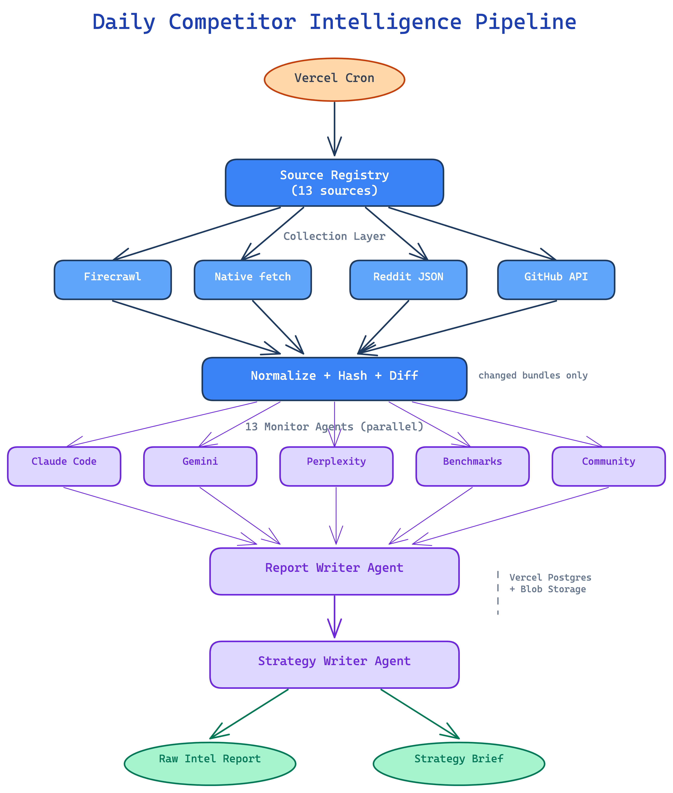

# OpenAI Competitor Intelligence Agent

A production-grade daily competitor intelligence system built for OpenAI Product Strategy. It monitors Anthropic, Google Gemini, and Perplexity across official product surfaces, public benchmark leaderboards, and community signals — then synthesizes findings into structured reports and executive strategy briefs.

## Architecture



The system runs as a daily automated pipeline:

1. **Vercel Cron** triggers the pipeline at 00:00 UTC
2. **Source Registry** defines 13 monitored sources across competitors, benchmarks, and community
3. **Collectors** (Firecrawl for JS-heavy pages, native fetch for stable HTML/APIs, Reddit JSON, GitHub REST) gather raw content
4. **Normalize + Hash + Diff** converts raw content into consistent payloads, detects changes via content hashing, and skips unchanged sources to reduce cost
5. **13 Monitor Agents** run in parallel on changed bundles, each producing structured signals with confidence scores
6. **Report Writer Agent** synthesizes all monitor outputs into a detailed markdown intelligence report
7. **Strategy Writer Agent** converts the report into an executive strategy brief with a 1–100 risk score
8. **Outputs**: dated `raw-intel/<date>.md` and `strategy-brief/<date>.md` artifacts

## Tech Stack

- **LLM**: OpenAI Agents SDK with `gpt-5.4-nano`
- **Orchestration**: Next.js App Router on Vercel + Vercel Cron Jobs
- **Storage**: Vercel Postgres (relational data) + Vercel Blob (markdown artifacts)
- **Scraping**: Firecrawl HTTP API + native `fetch` + Cheerio
- **APIs**: GitHub REST API, Reddit JSON feeds
- **Quality**: OpenAI Evals API (16 eval datasets), Vitest

## Monitored Sources

| Category | Sources |
|----------|---------|
| Anthropic | Claude Code changelog, official announcements |
| Google Gemini | Release notes, blog |
| Perplexity | Comet changelog, research blog |
| Benchmarks | Scale SWE-bench Pro, LiveBench, LMSYS Arena, Artificial Analysis, LLM Stats |
| Community | Reddit (r/LocalLLaMA, r/singularity, r/artificial, r/LLM), GitHub repo metrics |
| OpenAI baseline | API docs changelog, news RSS, models API |

## Quick Start

```bash
pnpm install
cp .env.example .env.local
# Fill in OPENAI_API_KEY and FIRECRAWL_API_KEY

# Run with fixture data (no API keys needed)
PIPELINE_USE_FIXTURES=1 pnpm intel:sample

# Run with live data
pnpm intel:sample
```

## Scripts

| Command | Description |
|---------|-------------|
| `pnpm intel:sample` | Run the full pipeline once |
| `pnpm evals:all` | Run all 16 OpenAI Evals |
| `pnpm test` | Run Vitest test suite |
| `pnpm typecheck` | TypeScript type checking |
| `pnpm dev` | Start Next.js dev server |

## Project Structure

```
src/
  agents/       # OpenAI Agents SDK runtime (monitor, report, strategy agents)
  pipeline/     # Daily orchestration, submission builder
  sources/      # Source registry, collectors, normalizers
  prompts/      # 15 agent prompt files (markdown)
  evals/        # Eval catalog + 17 JSONL datasets
  lib/          # Types, storage, utilities
app/
  api/cron/     # Vercel Cron endpoint
raw-intel/      # Generated daily intelligence reports
strategy-brief/ # Generated daily strategy briefs
```
